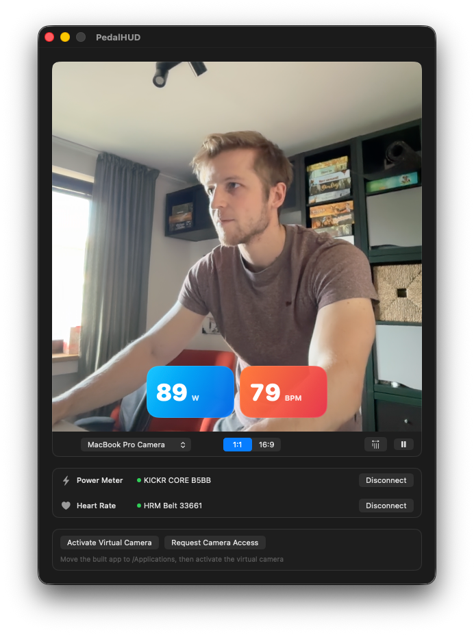
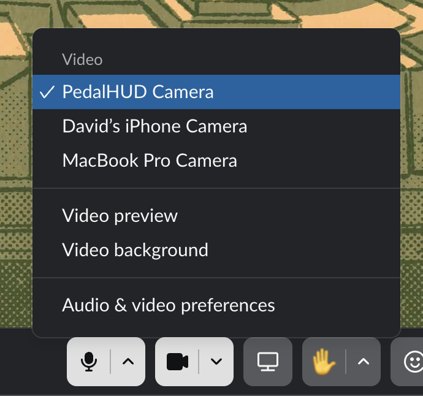

# PedalHUD

PedalHUD puts your watts and heart rate on camera.

PedalHUD is a macOS app that connects to supported Bluetooth trainers and heart rate monitors, then publishes a virtual camera with live power and heart-rate overlays for Zoom, Google Meet, Slack, and other apps that support virtual cameras.



## What It Does

- Connects to supported Bluetooth trainers and heart rate monitors.
- Composites live ride telemetry over a real webcam feed.
- Publishes the result through a CoreMediaIO virtual camera extension.
- Lets you preview the output locally before joining a call.
- Supports signed releases with in-app Sparkle updates.

## How To Use

1. Open PedalHUD and select your webcam as the source camera.
2. Connect your Bluetooth power meter and/or heart rate monitor using the dropdowns in the app.
3. Click **Activate Virtual Camera** to register the virtual camera with macOS.
4. In your video app (Slack, Zoom, Meet, etc.), choose **PedalHUD Camera** from the camera dropdown.



Your live power and heart rate overlay will now appear on your camera feed for everyone in the call.

## Download And Install

Download the latest signed release from [GitHub Releases](https://github.com/davidmokos/PedalHUD/releases/latest).

1. Download the latest archive.
2. Move **PedalHUD.app** into `/Applications`.
3. Open the app from `/Applications`.
4. Grant Bluetooth and camera access when macOS prompts you.
5. Click **Activate Virtual Camera**.
6. Approve the system extension in **System Settings > Privacy & Security** if macOS asks.
7. In Slack, Zoom, Meet, or another video app, choose **PedalHUD Camera** as your camera.

Installed builds use [Sparkle](https://sparkle-project.org) to check for updates from inside the app.

## Requirements

- macOS 15.0 or newer
- A supported webcam
- Bluetooth trainer (tested with Wahoo KICKR) and/or Bluetooth heart rate monitor — at least one is needed for a good experience

## Build From Source

PedalHUD ships with a checked-in Xcode project and a Swift package for shared code.

### Prerequisites

- macOS 15.0 or newer
- Xcode 16.2 or newer
- An Apple Developer account if you want to sign and activate the virtual camera locally

### Local Setup

1. Copy `Config/Local.xcconfig.example` to `Config/Local.xcconfig`.
2. Fill in your team ID and bundle ID prefix.
3. Open `PedalHUD/PedalHUD.xcodeproj` in Xcode, or build from the command line.

### Test And Build

```bash
swift test

xcodebuild -allowProvisioningUpdates \
  -project PedalHUD/PedalHUD.xcodeproj \
  -scheme PedalHUD \
  -destination 'platform=macOS' \
  -derivedDataPath .build/xcode \
  build
```

To test the virtual camera reliably, install the built app into `/Applications`:

```bash
rsync -a --delete '.build/xcode/Build/Products/Debug/PedalHUD.app/' '/Applications/PedalHUD.app/'
open -n /Applications/PedalHUD.app
```

More detail lives in [docs/xcode-project-setup.md](docs/xcode-project-setup.md).

## Repository Guide

- `Apps/PedalHUDMac` - macOS host app
- `Apps/PedalHUDCameraExtension` - CoreMediaIO virtual camera extension
- `Sources/PedalHUDCore` - shared overlay, metrics, and configuration code
- `docs/` - architecture, setup, and contributor documentation

## Documentation

- [Architecture](docs/architecture.md)
- [Development setup](docs/xcode-project-setup.md)
- [Contributing](CONTRIBUTING.md)
- [Security policy](SECURITY.md)
- [Changelog](CHANGELOG.md)

## Troubleshooting

- Launch and test the copy installed in `/Applications`, not an Xcode-run copy.
- If the virtual camera does not appear in video apps, restart PedalHUD first.
- If macOS shows old extension versions waiting to uninstall, reboot before testing again.
- If you change extension-rendering code locally, bump the app and extension versions together before re-testing.

## Contributing

Issues and pull requests are welcome. Start with [CONTRIBUTING.md](CONTRIBUTING.md).

## License

PedalHUD is released under the [MIT License](LICENSE).
